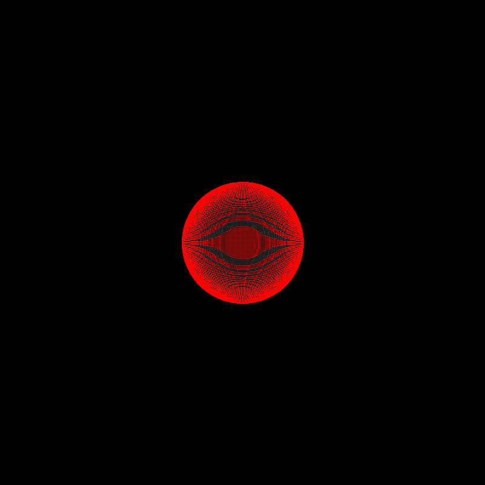
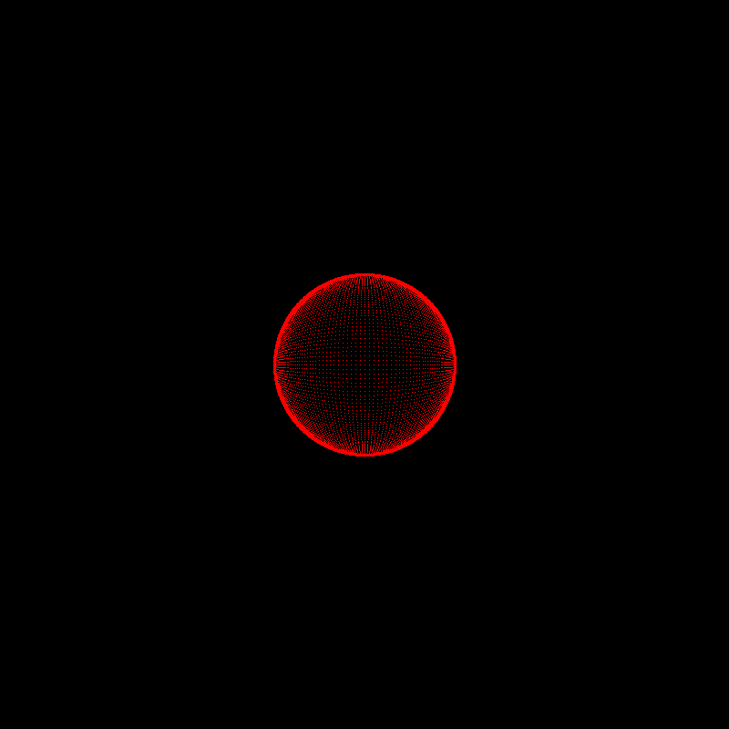

# Gallery

Images of renders from the exercises by chapter

 

## Chapter 2. Drawing on Canvas

    

 

## Chapter 4. Matrix transformations

    

 

## Chapter 5. Ray-Sphere intersections

    
    
    
    
    

 

## Chapter 6. Light and shading

    
    

 
